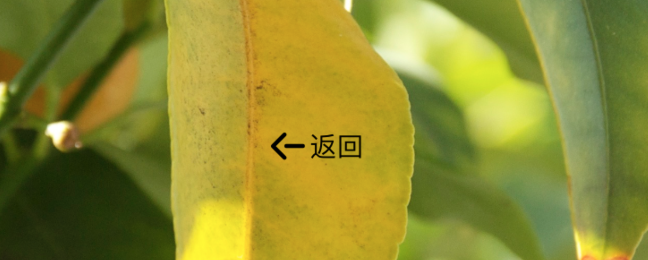
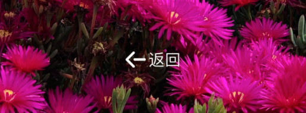

# 能够自动感知背景主色调的按钮

## 什么要写这个东东？

现在的 UI 非常喜欢使用浸入式设计，比如说大图片背景之上放一个按钮，效果图看起来非常漂亮，高端大气上档次。但是 UI 往往忘记了这样一个事实，app 中的图片是会变的，效果图中使用一张深色的背景图片，配上白色的按钮看起来非常漂亮，但当背景图变成浅色的背景时怎么办？你马上连按钮都看不见了。

于是必须找出一种方法，能够从背景图片中找出图片的主色调，然后根据这个主色调动态调整按钮文字或图片颜色。

这个过程大概可以分成 3 个任务：

1. 从 UIImage 中找出这张图片的主色调

	这个任务我找到了一个第三方开源库 [iOSPalette](https://github.com/tangdiforx/iOSPalette)，非常感谢 iOSPalette 的作者。我 Fork 了这个库，本来想修改后直接 pull request。但是后面觉得也不合适，因为原来的库叫做 iOSPalette，该库的目标是读取位图中的颜色值进行计算，和 UIKit 并没有太直接的关系。因此重新创建了这个库。此外，在计算主色调时，为了使计算更加准确，我没有直接用整张背景图进行计算，而是对背景图所在的 View 进行截屏，然后缩小采样区域，只截取按钮 frame 所遮盖住的部分。
2. 根据主色调计算出一个互补色，用它来作为按钮图片的颜色。

	算法是从网上找到，很简单，具体你可以看 UIColor+Complementary 这个分类。后面感觉互补色的效果看起来不是很好，于是又根据主色调的 RGB 值计算颜色的流明度，根据流明度的不同，返回黑色或者白色。
3. 将图片按钮的颜色替换成指定色（黑色或者白色）。

	这里使用了过去在项目中用过的一个分类 UIImage+Extension。

最终封装了一个 UIButton+BlackWhiteImage 分类，你只需在代码中 import 这个分类并在 UIButton 上调用它的方法即可。比如：

```
 [self.btBack setBlackWhiteImageWithImage:[UIImage imageNamed:@"返回"] backgroundView:self.ivPhotoPreview option:nil];
```
这样，按钮的颜色就会自动适配随背景 view 的主色。看效果：





## 安装

项目是开源的，直接拷贝 Source 目录到你的项目中并在代码中导入 UIButton+BlackWhiteImage.h 即可。

先将就用一段时间，等有空的时后我会放到 CocoaPods 上。


